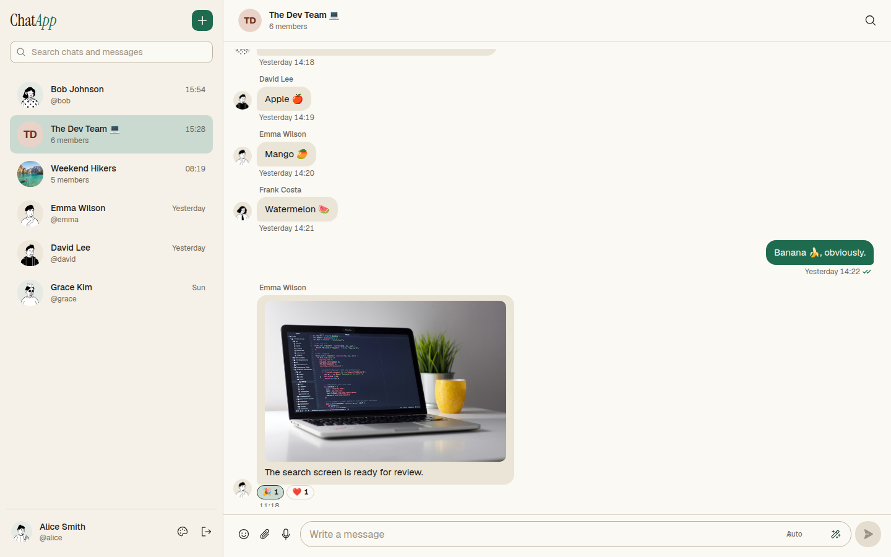
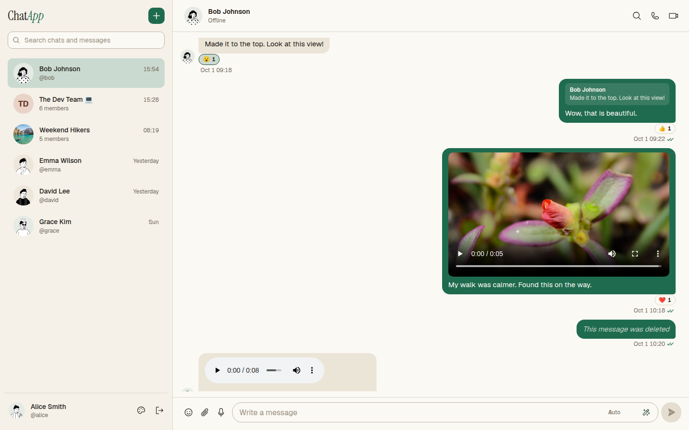
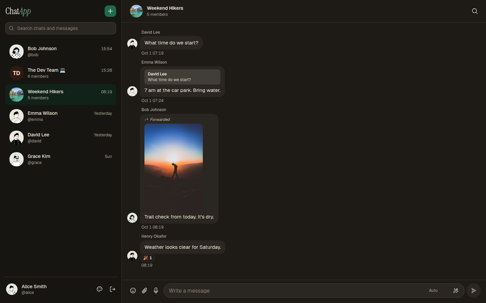
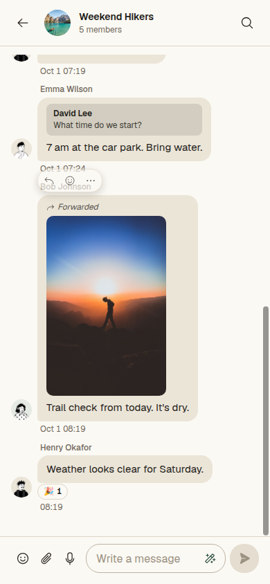
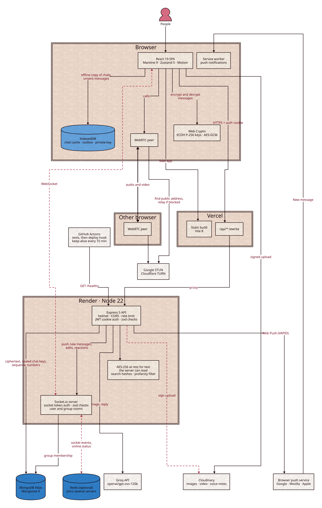

<h1 align="center">ChatApp</h1>

<p align="center">
  A full-stack real-time chat app with group chats, voice notes, and peer-to-peer voice and video calls.<br>
  Messages are end-to-end encrypted in the browser, so the server stores text it can't read.
</p>

<p align="center">
  <a href="https://chatapp-e2e.vercel.app/"></a>
  <a href="https://github.com/Sarcastic-Soul/ChatApp/actions/workflows/ci.yml"></a>
  <a href="https://github.com/Sarcastic-Soul/ChatApp/actions/workflows/keep-alive.yml"></a>
</p>

<p align="center">
  
  
  
  
</p>

<p align="center">
  <a href="#try-it">Try it</a> ·
  <a href="#features">Features</a> ·
  <a href="#architecture">Architecture</a> ·
  <a href="#how-it-works">How it works</a> ·
  <a href="#tech-stack">Tech stack</a> ·
  <a href="#run-it-locally">Run it locally</a> ·
  <a href="#testing">Testing</a> ·
  <a href="https://chatapp-e2e.vercel.app/docs/">API reference</a> ·
  <a href="docs/deployment.md">Deployment</a>
</p>

<p align="center">
  
</p>

<table>
  <tr>
    <td width="40%"></td>
    <td width="40%"></td>
    <td width="20%"></td>
  </tr>
  <tr>
    <td align="center">Photos, video and audio</td>
    <td align="center">Dark mode</td>
    <td align="center">On a phone</td>
  </tr>
</table>

## Try it

Open the [live app](https://chatapp-e2e.vercel.app/) and press **Try the demo account**, or log in by hand:

| Username | Password | Encryption passphrase |
| --- | --- | --- |
| `alice` | `password123` | `alice demo passphrase` (filled in for you) |

Good to know:

- **The demo account is shared**, so its passphrase is public.
- **Alice's chats show every feature**: photos, a video, an audio clip, replies, reactions, edited, deleted and forwarded messages, call logs and two groups.
- **Demo chats are not end-to-end encrypted.** The seeded people have never logged in and have no keys, so those chats are encrypted on the server only.
- **To see end-to-end encryption**, sign up two accounts of your own.

## Features

### Messaging

- One-on-one and group chats, with typing indicators, read receipts and online status
- Replies, edits, delete for everyone, reactions and forwarding
- Images, video and voice notes, uploaded straight from the browser to Cloudinary
- **Search** every chat's messages from the sidebar; picking a result jumps to that message
- **Offline sending:** messages written offline wait in an outbox and go out once the server is reachable, never twice, in the same order on every device
- **Fast opening:** chats open from an IndexedDB cache, then refresh from the server (75% faster on 3G, see [Cache benchmark](docs/testing.md#cache-benchmark))
- **Several servers:** can run on many servers at once, joined through Redis (see [Load test](docs/testing.md#load-test))

### Calls and notifications

- Voice and video calls between browsers over WebRTC, with mute and camera toggles
- Missed and finished calls are logged in the chat
- Push notifications for new messages while the app is closed (on iPhone, after adding it to the home screen)

### Groups

- Create groups, rename them, change the icon, add and remove members
- Several admins per group; the last admin can't be removed

### AI magic reply

- Drafts your next message from the last few messages of the chat
- Pick a tone (Auto, Professional, Casual or Funny), then edit the draft before sending
- In an end-to-end encrypted chat it asks first, since the recent messages leave the browser as plain text

### Privacy and safety

- **End-to-end encryption** for one-on-one chats and groups (ECDH P-256 and AES-GCM in the Web Crypto API), with a lock in the chat header when it's on
- **Passphrase backup** of your key, so a new browser can read your history; the server never sees the passphrase
- **AES-256 encryption at rest** for everything else: chats where someone has no key yet, call logs and group notices
- **Profanity is masked** (`****`) before a message is sent, in the browser for encrypted chats
- **Private profiles** don't show up in user lists, and can't be messaged by new people or added to groups

### Interface

- Light, dark or system theme, with five accent colors
- Works on phones, with larger tap targets on touch screens
- Respects the "reduce motion" system setting

## Architecture

<p align="center">
  
</p>

## How it works

| Topic | In one line |
| --- | --- |
| [Requests](docs/how-it-works.md#requests) | Vercel serves the app and forwards `/api/*` to Render |
| [Login](docs/how-it-works.md#login) | JWT in an `HttpOnly` cookie, plus a 5-minute token for the socket |
| [Real-time updates](docs/how-it-works.md#real-time-updates) | One socket room per user and per group |
| [Delivery](docs/how-it-works.md#delivery) | Outbox, client-made IDs and per-chat sequence numbers |
| [Several servers](docs/how-it-works.md#several-servers) | Redis joins the Socket.IO servers together |
| [End-to-end encryption](docs/how-it-works.md#end-to-end-encryption) | Keys made in the browser; the server only sees ciphertext |
| [Encryption at rest](docs/how-it-works.md#encryption-at-rest) | AES-256-CBC for text the server can read |
| [Search](docs/how-it-works.md#search) | Keyed hashes of words, so encrypted text can still be found |
| [Input checks](docs/how-it-works.md#input-checks) | zod schemas on every route and socket event |
| [Calls](docs/how-it-works.md#calls) | WebRTC between browsers, with STUN and TURN |
| [Notifications](docs/how-it-works.md#notifications) | Web Push with VAPID keys and a service worker |
| [Magic reply](docs/how-it-works.md#magic-reply) | Last 10 messages go to Groq for a draft |
| [Uploads](docs/how-it-works.md#uploads) | Browser uploads straight to Cloudinary |

The full write-up, with the delivery, scaling and encryption details, is in [docs/how-it-works.md](docs/how-it-works.md).

## Tech stack

| Area | Tools |
| --- | --- |
| Frontend | React 19, TypeScript, Vite 8, Mantine 9, React Router 8, Zustand 5, Motion, Phosphor Icons, Socket.io client, `idb` |
| Backend | Node.js 22, TypeScript (run by Node directly), Express 5, Socket.io 4, Mongoose 9, zod 4, JWT, bcrypt, helmet, `express-rate-limit`, `leo-profanity` |
| Services | MongoDB, Cloudinary, Groq, Google STUN, Cloudflare TURN |
| Hosting | Vercel (frontend and `/api` proxy), Render (API and sockets), GitHub Actions (keep-alive ping) |
| Tooling | Docker Compose, nginx, Redis, k6, pnpm, Vitest, supertest, mongodb-memory-server, ESLint 10 (flat config, typescript-eslint), GitHub Actions CI, D2 |

## Testing

| Suite | Size | Runs on |
| --- | --- | --- |
| Backend | 184 tests, about 86% line coverage | Vitest, `supertest`, `mongodb-memory-server`, real `socket.io-client` sockets |
| Frontend | 65 tests | Vitest, Testing Library on jsdom, `fake-indexeddb`, real Web Crypto |
| End to end | One full two-browser run | Playwright, the real backend on an in-memory MongoDB, and the Vite app |

GitHub Actions runs all three suites, ESLint and the production build on every push. What each suite checks is in [docs/testing.md](docs/testing.md).

### Benchmarks

**Opening a chat, with and without the IndexedDB cache** (median of 10 runs, 50 messages):

| Network | No cache | With cache | Faster by |
| --- | --- | --- | --- |
| No throttling | 198 ms | 166 ms | 16% |
| Fast 4G | 240 ms | 174 ms | 28% |
| Slow 4G | 289 ms | 111 ms | 62% |
| 3G | 407 ms | 104 ms | 75% |

**Message delivery latency under load** (k6, 60-second runs, all on one laptop):

| Setup | Load | Delivered | Missing | p50 | p95 | p99 |
| --- | --- | --- | --- | --- | --- | --- |
| 1 server | 100 pairs, 50 msg/s | 2,900 | 0 | 61 ms | 178 ms | 320 ms |
| 3 servers + Redis | 100 pairs, 50 msg/s | 2,898 | 2 | 56 ms | 213 ms | 376 ms |
| 1 server | 250 pairs, 125 msg/s | 7,249 | 1 | 17 ms | 398 ms | 747 ms |
| 3 servers + Redis | 250 pairs, 125 msg/s | 7,231 | 2 | 8 ms | 766 ms | 1,572 ms |

How these were measured, and how to read them, is in [docs/testing.md](docs/testing.md#cache-benchmark).

## Run it locally

You need Docker with Compose. One command starts MongoDB, the backend and the frontend:

```bash
git clone https://github.com/Sarcastic-Soul/ChatApp.git
cd ChatApp
docker compose up --build -d
docker compose exec backend node seed.ts   # demo users, password123
```

Then open http://localhost:8080 and log in as `alice`.

Running without Docker, the three-server setup, every script and the environment variables are in [docs/development.md](docs/development.md).

## More documentation

| Page | What's in it |
| --- | --- |
| [API reference](https://chatapp-e2e.vercel.app/docs/) | All 39 routes, built from the zod schemas the server checks input with |
| [How it works](docs/how-it-works.md) | Delivery, scaling, encryption and search in detail |
| [Development](docs/development.md) | Running locally, scripts, environment variables and the folder tree |
| [Testing](docs/testing.md) | What the tests cover, and how the benchmarks were measured |
| [Security](SECURITY.md) | What is and isn't protected, and how to report a problem |

## License

MIT. See [LICENSE](./LICENSE).
